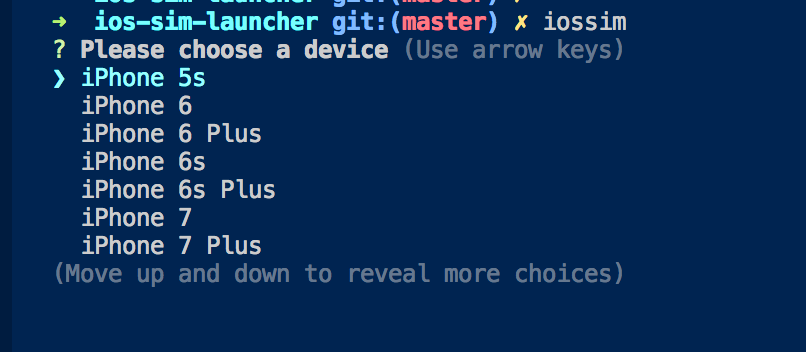

## IOS DEVICE SIMULATOR CLI

### Easiest way to boot up an iOS Simulator without any copy/paste. Simply select from a list.

Adds command line tool, simply run `iossim`

## How to contribute
- fork repo
- npm install
- npm run build
- submit pr